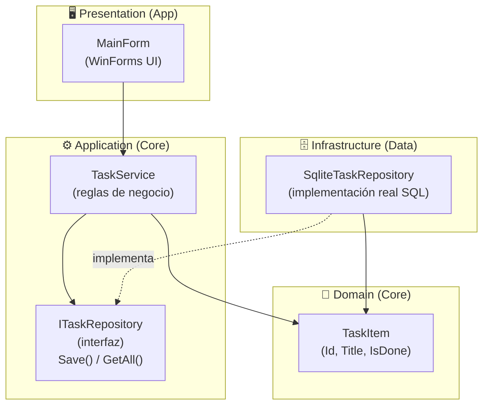
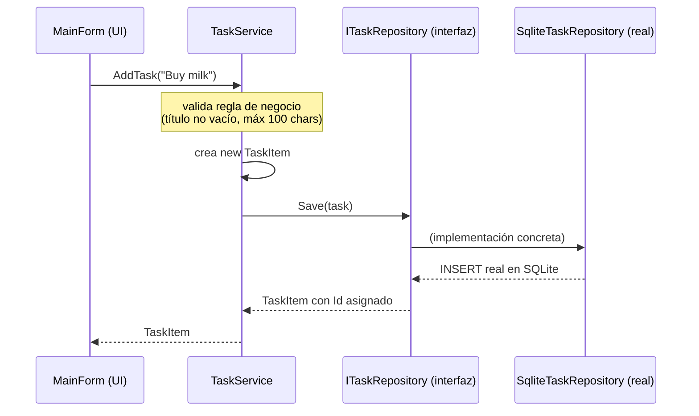
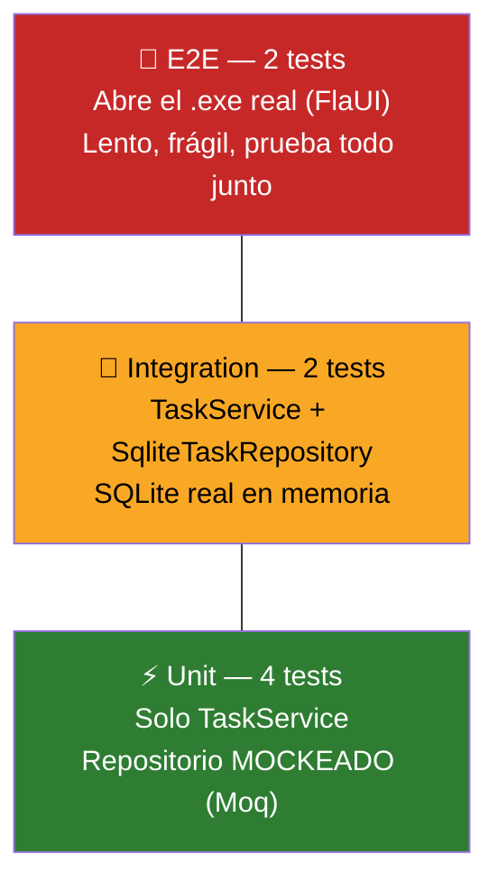

# Fundamentos: Clean Architecture + Unit/Integration/E2E Testing

> Resumen de los conceptos revisados sobre **SimpleTaskApp**, el proyecto
> de práctica para aplicar el mismo patrón en TradeSignal / options-trader-backend.

---

## 1. Las capas del proyecto



En este demo, **Domain y Application viven juntos** dentro del proyecto
`SimpleTaskApp.Core` — es común fusionarlos en proyectos chicos. En
`options-trader-backend` sí están separados en dos `.csproj` distintos
porque el dominio es más grande.

| Proyecto físico | Capa Clean Architecture | Ejemplo |
|---|---|---|
| `SimpleTaskApp.Core` | Domain **+** Application | `TaskItem`, `ITaskRepository`, `TaskService` |
| `SimpleTaskApp.Data` | Infrastructure | `SqliteTaskRepository` |
| `SimpleTaskApp.App` | Presentation | `MainForm` |

---

## 2. La relación Domain ↔ Service ↔ Repository

Este es el patrón que se repite en casi cualquier proyecto serio en GitHub
que sigue Clean/Onion/Hexagonal Architecture:



**Regla de oro:** el `Service` nunca depende de la implementación concreta
del repositorio (`SqliteTaskRepository`), solo de su **interfaz**
(`ITaskRepository`). Eso se llama **Dependency Inversion** y es lo que
permite:

- Cambiar SQLite por SQL Server sin tocar la lógica de negocio
- Reemplazar el repositorio por un **mock** en los tests unitarios

| Clase | Rol | Sabe de... | No sabe de... |
|---|---|---|---|
| `TaskItem` | Entidad (dato puro) | Nada | SQL, UI, reglas |
| `ITaskRepository` | Contrato de persistencia | Las operaciones (`Save`, `GetAll`) | Cómo se implementan |
| `TaskService` | Lógica de negocio | La interfaz `ITaskRepository` | SQLite, WinForms |
| `SqliteTaskRepository` | Implementación real | SQL de verdad | Reglas de negocio |

---

## 3. La pirámide de testing



| Tipo | Qué prueba | Qué NO toca | Velocidad |
|---|---|---|---|
| **Unit** (`TaskServiceTests`) | Reglas de negocio puras (validación) | SQLite, disco, UI | Milisegundos |
| **Integration** (`SqliteTaskRepositoryTests`) | `TaskService` + `SqliteTaskRepository` juntos, SQL real | UI | Rápido (SQLite en memoria) |
| **E2E** (`MainFormE2ETests`) | La app completa, de punta a punta, como la usaría un humano | Nada — prueba todo | Lento (abre el `.exe` real) |

**Por qué existen los 3 niveles:**
- Un **unit test** te dice "la regla de negocio es correcta" sin
  importar cómo se persista.
- Un **integration test** te dice "el SQL/mapeo de columnas funciona
  de verdad" — algo que un mock nunca puede detectar.
- Un **E2E test** te dice "la app realmente funciona para el usuario
  final" — detecta problemas de UI, de cableado entre capas, etc.

---

## 4. Cómo Visual Studio sabe qué es un proyecto de test

No es por el nombre del proyecto (`E2ETests`) — es por los paquetes
NuGet declarados en el `.csproj`:

```xml
<PackageReference Include="Microsoft.NET.Test.Sdk" Version="17.11.1" />
<PackageReference Include="xunit" Version="2.9.0" />
<PackageReference Include="xunit.runner.visualstudio" Version="2.8.2" />
```

| Paquete | Rol |
|---|---|
| `Microsoft.NET.Test.Sdk` | Marca el proyecto como "test project" ante MSBuild/Visual Studio |
| `xunit` | El framework de testing — define `[Fact]`, `[Theory]`, `Assert` |
| `xunit.runner.visualstudio` | El adaptador que le permite al Test Explorer **descubrir** y **ejecutar** los tests |

Sin `xunit.runner.visualstudio`, aunque tengas métodos con `[Fact]`,
Visual Studio no sabría cómo encontrarlos ni correrlos.

---

## 5. Cómo correr cada tipo de test

**Desde la terminal:**
```bash
cd SimpleTaskApp.UnitTests
dotnet test
```
(mismo comando para `IntegrationTests` y `E2ETests`, ajustando la carpeta)

**Desde Visual Studio:**
1. `Test` → `Test Explorer` (o `Ctrl+E, T`)
2. Clic derecho sobre el proyecto o test → `Run`

**Antes del E2E**, hay que compilar `SimpleTaskApp.App` primero, porque
FlaUI abre el `.exe` real:
```bash
cd SimpleTaskApp.App
dotnet build
```

---

## 6. El mismo patrón aplicado a TradeSignal / options-trader-backend

| SimpleTaskApp (demo) | TradeSignal (real) |
|---|---|
| `TaskItem` | `Trade` |
| `TaskService` | Servicio de casos de uso (Application) |
| `ITaskRepository` / `SqliteTaskRepository` | `ITradeRepository` / implementación EF Core |
| Unit → `TaskServiceTests` | Unit → `ZoneAnalyzer`, `TrailingStopV3` |
| Integration → SQLite en memoria | Integration → `AnalysisEngine` + SQL Server/MinIO |
| E2E → `MainFormE2ETests` (FlaUI) | E2E → `MainForm.cs` de TradeSignal.App (FlaUI) |
